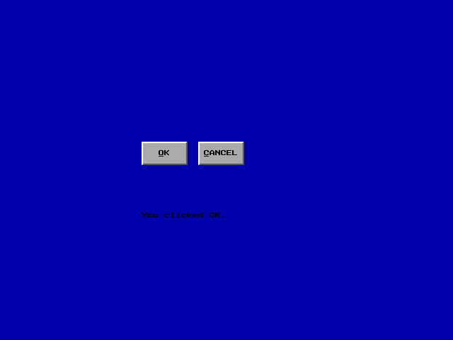
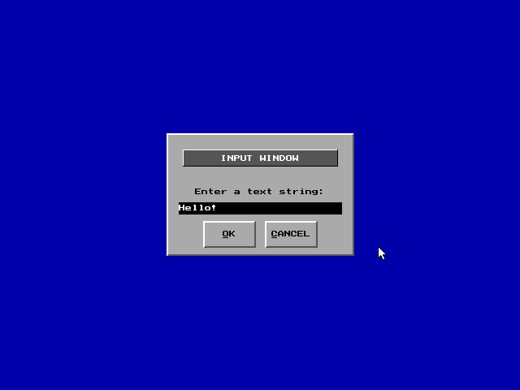

# Chapter 4: Graphical Controls and Windows

Development of graphical windows and basic controls. All window classes are
implemented inside `windw.h` and `windw.cpp`. Sample programs build on top
of classes and functionality from Chapter 3.

All programs tested and written using Turbo C++ 3.0

* windw.h / windw.cpp - Interface / Implementation for DOS window classes.
* wndw1.cpp - Window demonstration program 1.
  * 
* wndw2.cpp - Window demonstration program 2.
  * 
* wndw3.cpp - Window demonstration program 3.
  * 

