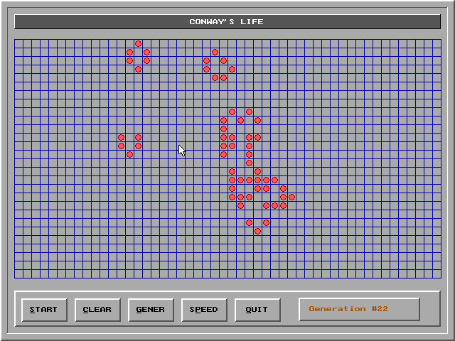

# Chapter 5: The Game of Life

Development of Conway's game of Life using Turbo C++.

Programs build on top of classes and functionality from Chapter 3, and 4.
This is the first example that links the VGA driver in directly. To generate
the EGAVGA.OBJ you must run the following code.

```
C:\TC\BGI\BGIOBJ.EXE C:\TC\BGI\EGAVGA
```

* list1.cpp - Basic linked list example.
* list.h / list.cpp - An object oriented linked list.
* list2.cpp - Test program utilizing list.h / list.cpp.
* clist.h / clist.cpp - An adaptation of list.h / list.cpp to hold "cells".
* life.cpp - Conway's game of Life utilizing classes from the previous chapters.
  * 

