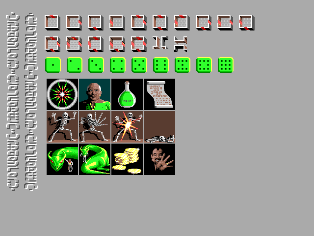

# Chapter 6: Loading and Displaying Pictures

This chapter covers development of a class and test program to read PCX
image files. A sample DRAGON.PCX is also included (used in the next
chapter).

The example program links the VGA driver directly.
To generate the EGAVGA.OBJ you must run the following code.

```
C:\TC\BGI\BGIOBJ.EXE C:\TC\BGI\EGAVGA
```

* pcx.h / pcx.cpp - A class to read and show PCX image files.
* testpcx.cpp - Example program utilizing pcx classes to display PCX files.
  * 

